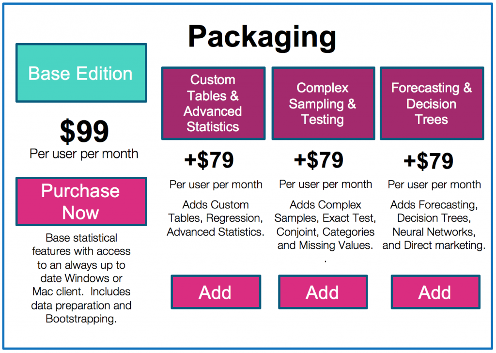
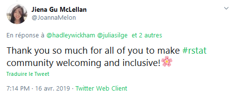
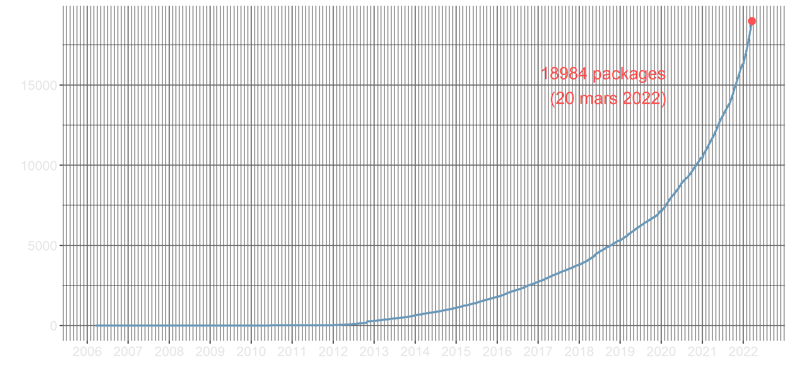
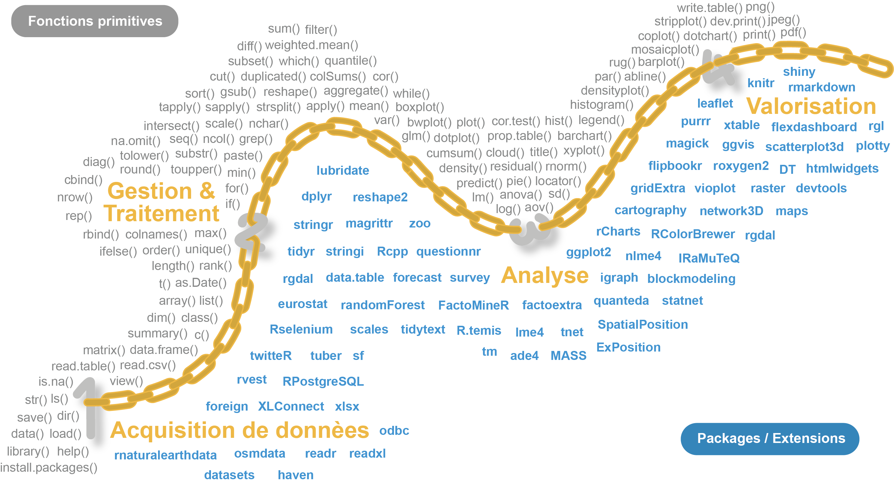
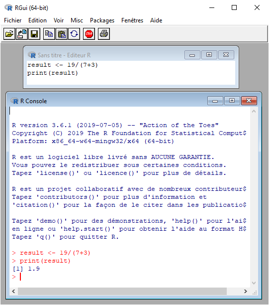

```{r setup, include=FALSE}
knitr::opts_chunk$set(echo = FALSE)
options("scipen" = 10)


```


# Logiciels d'analyse statistique


## SAS, SPAD, SPSS... et R


<br>

<p class="smallpcenter">**Depuis le début des années 2000, un nouveau logiciel** gagne en importance et **s'impose progressivement comme une référence**, au même titre que les trois principaux logiciels d'analyse de données qui dominent le marché.</p> 


<p class="R"></p>


<p class="moyp">**On peut imaginer que les utilisateurs de logiciels statistiques vont progressivement converger vers R** </p>


## Les logiciels propriétaires sont... 

### Payants


</p>
<p class="xsmallp" align="center">Licence SPSS *Base edition*</p>


## Pas multi-plateforme


<br>
<br>


```{r }

Logiciel <- c("SAS","SPAD","SPSS","Stata")
Windows <- c("oui","oui","oui","oui")
macOS <- c("terminé","non","oui","oui")
Linux <- c("oui","non","non","oui")
BSD <- c("non","non","non","non")
Otros_Unix <- c("oui","non","non","non")

tab <- data.frame(Logiciel, Windows, macOS, Linux, BSD, Otros_Unix)

colnames(tab) <- c(" Logiciel/Système"," Windows", " MacOS", " Linux", " BSD", " Autres Unix")

knitr::kable(tab)
```


<p class="xsmallp" align="center">*https://fr.wikipedia.org/wiki/Comparaison_des_logiciels_de_statistiques*</p>


## Spécialisés 


<br>

<ul class="pucsmall">
> - **SPSS** : orienté vers les sciences sociales
> - **SPAD** : orienté vers la prise de décision
> - **Stata** : orienté pour les économistes et épidémilogistes
> - **SAS** : assez complet, limité dans certains domaines (ex: graphique)

</ul>

<br>

<p class="moyp">Ils offrent **peu ou pas** d'**analyse de réseau**, d'**analyse de séquence**, de **léxicométrie** (sauf SPAD)... Et très peu de fonctionnalités de valorisation.</p> 


## Limités


<p class="moyp3">**La gestion centralisée induit des limites** de :</p>


<ul class="pucsmall" style="padding:40px;">      
> - **Durabilité**
> - **Liberté d'utilisation**
> - **Compatibilité** avec d'autres logiciels (format des données)
> - **Mise à jour** et compatibilité entre versions 
> - **Développement** de nouvelles fonctionnalités
> - **Langues** disponibles (logiciel et aide)
> - **Ressources d'information** disponibles

</ul>

## Des obstacles pour...

<br>

<ul class="pucsmall">
> - La **formation**
> - L'**utilisation**
> - Le **travail collaboratif**
> - Le **travail interdisciplinaire**
> - Le **travail reproductible**

</ul>

<br>

<p class="normp">C'est pour cela que l'on utilise R</p>


# {data-background="figure/RvsPython.png" data-background-size="1000px"}


##  Frères ennemis

<br>

<p class="moyp">**Deux langages** très utilisés pour l'analyse et le traitement des données.    
**Très souvent comparés pour leurs fonctionnalités semblables**...</p>


<p align="center""></p>


<p class="normp">Le choix entre **R** et **Python** dépend surtout de    
**Qui je suis** et de **ce que je veux faire** ?</p>

##  Deux communautés

<p class="moyp" align="center" style="margin-bottom:0px;">**différentes...**</p>

<div id="left" style="padding: 20px 0px 0px 20px;">
<p align="center" style="padding-top:0px 0px 0px 0px;margin-top:0px;"></p>

<p align="center" style="padding-top:0px 0px 0px 0px;margin-top:0px;"></p>

<ul class="xpucsmall" style="margin-top:30px;">
> - Communauté **accessible** et **inclusive**
> - **Documentation** riche et **structurée**
> - Discipline : **analyse de données**
> - Métiers : **recherche & développement**


</ul>

</div>

<div id="right">
<p align="center" style="margin-top:0px;padding-top:0px;"></p>


<p align="center" style="padding-top:0px 0px 0px 0px;margin-top:0px;"></p>

<ul class="xpucsmall" style="margin-top:0px;">
> - Communauté de **spécialistes**
>-  Langage **plus utilisé**
> - Discipline : **science des données**
> - Métiers : **informaticien**, **développeur**...


</ul>
</div>

<br>


##  Des spécificités
     

<div id="left">

<p class="moyp" align="center" style="padding-top:0px;margin-top:0px;">**R** a autant de cerveau...<p>

<p align="center" style="padding-top:0px;margin-top:30px;"></p>


<ul class="xpucsmall" style="margin-top:20px;">
> - Plus **facile à prendre en main** (Rstudio)
> - **Analyse statistique**
> - **Représentation graphique**
> - **Valorisation** (markdown, application...)

</ul>


<p class="smallpcenter3">Pour les **utilisateurs moins avancés** en programmation       
spécialisés dans l'**analyse de données**<p>


</div>


<div id="right">

<p class="moyp" align="center" style="padding-top:0px;margin-top:0px;">...que **Python** a du muscle !<p>

<p  style="align:center;margin-top:0px 0px 0px 0px;padding-top:0px 0px 0px 0px;"></p>


<ul class="xpucsmall" style="margin-top:20px;">
> - Plus **puissant** et généraliste
> - Gestion de **données volumineuses**
> - **Web scraping** et **NLP**
> - **Développement de logiciel**

</ul>


<p class="smallpcenter3">Pour les **utilisateurs avancés** en programmation    
spécialisés dans la **science de données**<p>


</div>


#  {data-background="figure/R.png" data-background-size="450px"}

## Histoire de R

<br>


<p class="smallpcenter">**R se base sur le langage de programmation S**, créé en 1988</p> 

<ul class="xpucsmall">
> - **1992**: **R. Gentleman** et **R. Ihaka démarrent le développement** (projet de recherche)
> - 1993: **Première version binaire** de R publiée sur Statlib
> - **1995**: **R est distribué en tant que logiciel open source, sous licence GPL2**
> - 1997: Création du *R core group*. Création du CRAN (par K. Jornik et F. Leisch)
> - 1999: Création du site web de R (*r-project.org*) . Première réunion physique de la *R core team* 
> - **2000**: **R 1.0.0** est publié. John Chambers (créateur du langage S), rejoint la *R Core team* 
> - 2001: Création de *R News* (qui deviendra *R Journal*)
> - **2003**: **Création de la** ***R Foundation***
> - 2004: Première conférence *UseR!* (Vienne)
> - **2004**: **R 2.0.0** est publié
> - 2009: Première édition du *R Journal*
> - **2013**: **R 3.0.0** est plublié
> - **2015**: **Création du** ***R Consortium*** (avec la participation de la *R Foundation*)
> - **2020**: **R 4.0.0** est plublié    

</ul>
<br>
<p class="xsmallp" align="center">*https://blog.revolutionanalytics.com/2017/10/updated-history-of-r.html*</p>


## Soutiens importants


<br>

<p class="normp">Résultat de **30 années de recherche & développement**</p>

<br>

Des acteurs économiques importants **financent** le développement de **R** : ***Microsoft***, ***Google***, ***Oracle***, ***Esri***... 

<br>

<p class="moyp">https://www.r-consortium.org/members.</p>


## Libre et multi-plateforme

<aside class="notes">
Il fait partie du mouvement du logiciel libre (lancé par Richard Stallman en 1985), qui est un mouvement politique et social dont l'objectif est d'offrir des logiciels libres de secrets commerciaux  (un code source libre).

</aside>


<br>

<ul class="pucsmall">

> - **R est un logiciel/langage libre (open source)** 

<br>

> - Il fait partie de la liste des **paquets GNU GPLv3**


<br>

> - **R est multi-plateforme**


</ul>

<br>


```{r}

Software <- c("R")
Windows <- c("oui")
macOS <- c("oui")
Linux <- c("oui")
BSD <- c("oui")
Otros_Unix <- c("oui")

tab <- data.frame(Software, Windows, macOS, Linux, BSD, Otros_Unix)

colnames(tab) <- c(" Logiciel/Sytsème"," Windows", " MacOS", " Linux", " BSD", " Autres Unix")

knitr::kable( tab)
```


## Développement illimité

<br>

```{r warning=FALSE, message=FALSE, eval=TRUE, include= TRUE, echo=FALSE}

library('rvest')
url <- "https://cran.r-project.org/web/packages/available_packages_by_date.html"
#Reading the HTML code from the website
webpage <- read_html(url)
td <- webpage %>%  html_nodes("td")
rank_data <- html_text(td)

vec <- c(NULL)
for (t in seq(1,length(rank_data),3))  {
vec <-  c(vec, rank_data[t])
}

library(stringr)
vec <- str_trim(vec)
test <- as.data.frame(vec)
test$nb <- 1
test$date <- as.Date(test$vec)
test <- test[,c(3:2)]

library(plyr)
test2 <-  ddply(test, .(date), summarize, nb=sum(nb))
test2$cum <- cumsum(test2$nb)
test <- test2[,c(1:3)]

nb_function_base <- length(lsf.str("package:base"))

# Nombre de fonctions primitives
base <- length(lsf.str("package:base")) 
stats <- length(lsf.str("package:stats")) 
utils <- length(lsf.str("package:utils")) 
methods <- length(lsf.str("package:methods")) 
grDevices <- length(lsf.str("package:grDevices")) 
graphics <- length(lsf.str("package:graphics")) 
datasets <- length(lsf.str("package:datasets")) 

Nb_prim <- base + utils + stats + methods + grDevices + graphics + datasets 

library(grid)
library(splines)
library(stats4)
library(tcltk)
library(tools)
grid <- length(lsf.str("package:grid")) 
splines <- length(lsf.str("package:splines")) 
stats4 <- length(lsf.str("package:stats4")) 
tcltk <- length(lsf.str("package:tcltk")) 
tools <- length(lsf.str("package:tools")) 

Nb_prim_2 <- grid + splines + stats4 + tcltk + tools


Nb_prim <- Nb_prim  + Nb_prim_2

```


<p class="smallpcenter">**R propose `r Nb_prim` fonctions** statistiques et graphiques **standard** (primitives)</p>

<p class="smallpcenter">Sur ce socle commun peut s'**ajouter de nombreux packages**, mis à disposition sur le      
[***Comprehensive R Archive Network***](https://cran.r-project.org/web/packages/available_packages_by_name.html) (**CRAN**). Ex : </p>

<ul class="xpucsmall">
> - ***quanteda*** - **analyse textuelle**
> - ***igraph*** - **analyse de réseau**
> - ***sf*** - **manipulation de données spatiales**
> - ***shiny*** - **applicacions web interactives**
> - ...
</ul>

<br>


<p class="moyp">**R a une structure modulaire qui offre toute une gamme d'applications possibles**. **Son expansion n'est limitée que par les contributions**.</p>


## Développement illimité

<br>

```{r warning=FALSE, message=FALSE, eval=TRUE, include= TRUE, echo=FALSE, fig.width = 10, fig.height=  4.8}

library(ggplot2) 

p <- ggplot(test2) + 
geom_line(aes(date, cum), lwd = 1, col = '#6c9aba') + 
xlab("") + 
ylab("") + 
scale_x_date( date_minor_breaks = "1 month", date_labels = "%Y", breaks = as.Date( c('2005-01-01', 
                                                                                     '2006-01-01', 
                                                                                     '2007-01-01', 
                                                                                     '2008-01-01', 
                                                                                     '2009-01-01', 
                                                                                     '2010-01-01', 
                                                                                     '2011-01-01',
                                                                                     '2012-01-01',
                                                                                     '2013-01-01', 
                                                                                     '2014-01-01', 
                                                                                     '2015-01-01', 
                                                                                     '2016-01-01', 
                                                                                     '2017-01-01', 
                                                                                     '2018-01-01', 
                                                                                     '2019-01-01', 
                                                                                     '2020-01-01', 
                                                                                     '2021-01-01'))) + 
annotate(geom = "text", x = as.Date('2018-08-23'), y = 15000, label = paste0( max(test2$cum), ' packages \n (', format(Sys.time(), '%d %b %Y'), ")"), color ="#ff5151", size = 5.5) + 
geom_point(aes(x = max(date), y = max(cum)), color = "#ff5151", size = 3) + 
theme(axis.text = element_text(size = 12, colour ="grey90"), 
      panel.background = element_rect(fill = "transparent"), 
      plot.background = element_rect(fill = "transparent", color = NA), 
      panel.grid.major = element_line(colour = "grey40"), 
      panel.grid.minor = element_line(colour = "grey25"), 
      legend.background = element_rect(fill = "transparent"), 
      legend.box.background = element_rect(fill = "transparent")) 

ggsave(p, filename = "figure/graph.png", bg = "transparent", dpi = 300) 

```


<p class="smallpcenter">Nombre de packages disponibles sur le [CRAN](https://cran.r-project.org/)</p>

</p>


## Polyvalent

<br>


<p class="moyp">Les **packages mises à disposition permettent d'opérer sur l'ensemble de la chaîne de traitement**. De la collecte des données à la valorisation des résultats (gaphique, document, site web...)<P> 

<br>


<p class="nrmp">**Cette polyvalence** permet à R de **compléter**, de **concurrencer** voire de **remplacer** toute une série de **logiciels existants**</p>


## Polyvalent

<br>

<p align="center"></p>


## Grande communauté d'utilisateurs

 
<p align="center"></p>

<p class="xsmallp">https://benubah.github.io/r-community-explorer/rugs.html</p>


## ...Et d'entreprises

<p align="center"></p>

<p class="xsmallp">https://data-flair.training/blogs/r-careers/</p>


## Fiable


<br>

<ul class="pucsmall">
> - **Financement d'acteurs économiques** (*R Consortium*)
> - **Communauté impliquée** et **importante**
> - Le fonctionnement d'un logiciel **open source est vérifiable**
> - Tous les logiciels ont des failles, mais...

</ul>


<br>       
<p class="moyp">**L'information circule vite dans les communautés des logiciels libres**.</p>


## Travaux reproductibles

<br>  

<ul class="pucsmall">

> - **Un seul logiciel** pour **toutes les étapes de traitement**
> - Les travaux sont **facilement archivés et partagés** (script) 
> - Il suffit d'**un ordinateur pour les reproduire....**


</ul>

<br>

<p class="moyp">**La reproductibilité**, c'est le **partage** et la **transparence** !</p>


## Inconvénients


<br>


<ul >
> - **R est avant tout un langage de programmation**


<br>

> - **R et ses ressources clefs sont en anglais**


<br>

> - **Une interface rudimentaire**


</ul>


#  {data-background="figure/Rstudio_logo.png" data-background-size="700px"}


## Qu'est-ce que Rstudio? 

<br>

<p class="smallpcenter">RStudio est une entreprise qui développe et publie des logiciels et des services basés sur le langage R.
**C'est l'acteur privé le plus important de la communauté R**.</p>  


<p class="smallpcenter">**Rstudio (ou ses employés) a développé plusieurs packages de référence**. *Ex :*</p>

<ul class="xpucsmall">
> - [**rmarkdown**](https://rmarkdown.rstudio.com/) (*literate programming*)
> - [**shiny**](https://shiny.rstudio.com/) (*application web*)
> - [**ggplot2**](https://ggplot2.tidyverse.org/) (*représentation graphique*)
> - [**dplyr**](https://dplyr.tidyverse.org/) & [**tidyr**](https://tidyr.tidyverse.org/) (*manipulation de tableau*)
> - [**stringr**](https://stringr.tidyverse.org/articles/from-base.html) (*manipulation de chaîne de caractères*)
> - ...

</ul>

<br>
      
<p class="smallpcenter">**Rstudio** propose également **un Environnement de Développement Intégré** ([**IDE**](https://rstudio.com/products/rstudio/)), qui **facilite énormément l'utilisation de R**.</p>


## Interface rudimentaire de R

<div id="left">

<p align="center"></p>


<p class="legend" align="center">*Interface de R sur Windows*</p>


</div>

<div id="right">

<p align="center"></p>


<p class="legend" align="center">*Pas d'interface sur Linux (terminal)*</p>

<br>

<p class="smallpcenter" >**L'IDE Rstudio facilite l'apprentissage de R et son utilisation**</p>

</div>


## IDE Rstudio

<p align="center"></p>


## IDE Rstudio

<p align="center"></p>

## Autres points forts

<br>

<ul class="pucsmall">
> - **Création de projet**
> - **Fonctionnalités clic-bouton**
> - **Auto-complétion**
> - **Raccourcis clavier**

</ul>

<br>

<p class="nrmp">Parce que c'est **simple**, **complet** et en constante **évolution**...</p>
   

**Utilisez l'environnement RStudio!**


# Installation 


## Installer R

<br>

<p class="moyp">**L'installation** de R et de l'IDE Rstudio **se fait comme n'importe quel autre logiciel**. Connectez-vous au [CRAN](https://cran.r-project.org/) pour télécharger R.</p>

<br>

<p align="center"></p>

<p class="moyp">https://cran.r-project.org/</p>


## Installer l'IDE Rstudio

      

<p class="moyp2">Téléchargez la **version 'Desktop'** sur le [site de Rstudio](https://rstudio.com/)</p>

<p align="center"></p>

<p class="moyp">https://rstudio.com/products/rstudio/download/</p>


## c'est parti !


<p align="center"></p>

**Lancez Rstudio** (pas R) pour commencer


# {data-background="figure/R.png" data-background-size="450px"}


<h3>**Réalisé avec...**</h3>

<br>
<br>
<br>
<br>
<br>
<br>
<br>
<br>


<p class="smallpcenter"><b>`r sessionInfo()[1]$R.version$version.string`</b></p>


## Diapositives libres (CC BY 3.0)


<br>


<p class="moyp">Consultation :</p>

<ul class="xpucsmall">


> - Version française:  https://hpecout.gitpages.huma-num.fr/R_presentation_FR/
> - English version:  https://hpecout.gitpages.huma-num.fr/R_presentation_EN/
> - Versión español:  https://hpecout.gitpages.huma-num.fr/R_presentation_SP/


</ul>


<br>

<p class="moyp">Code source :</p>

<ul class="xpucsmall">


> - Git (français): https://gitlab.huma-num.fr/hpecout/R_presentation_FR
> - Git (english): https://gitlab.huma-num.fr/hpecout/R_presentation_EN
> - Git (Español): https://gitlab.huma-num.fr/hpecout/R_presentation_SP

</ul>

<br>


## Documentation

<br>

<p class="smallpcenter">De nombreuses ressources documentaires référencées sur...</p>


<br><p class="moyp"><a href="http://rzine.fr" target="_blank">rzine.fr</a></p>


## Remerciements

<br>

<p class="moyp">[Timothée Giraud (CNRS)](https://github.com/rCarto)</p>

<p class="moyp">[Violaine Jurie (Université de Paris)](mailto:violaine.jurie@univ-paris-diderot.fr)</p>

<br>
<br>

<div id="left3">
<p align="center"></p>
</div>

<div id="center2">
<p class="smallpcenter">REVEAL.JS</p>
</div>

<div id="center3">
<p class="moyp"></p>
</div>

<div id="right3">

</div>


# Merci de votre attention 


## On continue ?

<br>

Partie 2 : [Introduction au langage et à  l'IDE Rstudio](https://hpecout.gitpages.huma-num.fr/Intro_R_Rstudio_FR/){target="_blank"}
<div class="litito">
>- Une super calculatrice
>- R et objets
>- R base et packages
>- Packages populaires
>- Les atouts de l'IDE Rstudio
>- Aide et documentation
</div>

<br>

<p class="smallpcenter">[Voir le diaporama](https://hpecout.gitpages.huma-num.fr/Intro_R_Rstudio_FR/){target="_blank"}</p>
